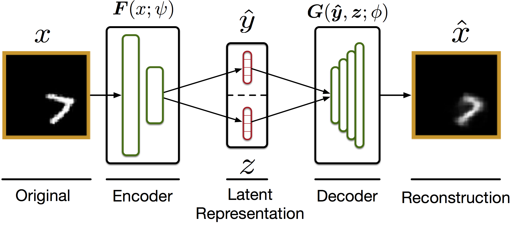

DuplexAE:
============

Abstract
--------
Brains have a very stereotyped structure to how they process/extract visual information. A single input in V1 is separated into spatial information (z) and location invariant identity info (y). It turns out we can create a network that does just this by structuring it as a split/diverging autoencoder (see below). We train the network to separate y and z by connecting them to a generator (G) that must synthesize a copy of the input from the information extracted in y and z. The loss function is then a combination of standard crossentropy on y, sum of squared error between the original and reconstruction, and a crosscovariance penalty on y and z to incentivize independence.

## Model


Code
----

### Installation

The easiest way to install is by cloning the cloning the github repository and install a dev version with pip

```bash
$ git clone https://github.com/elijahc/vae

```

### Usage

To be added...

Data
------

### Reproducibility

Most of the data for producing published figures from this project are available at [quiltdata.com/elijahc/DuplexAE](https://quiltdata.com/elijahc/DuplexAE)

Support
-------
This research was funded by NDSEG, CIFAR
